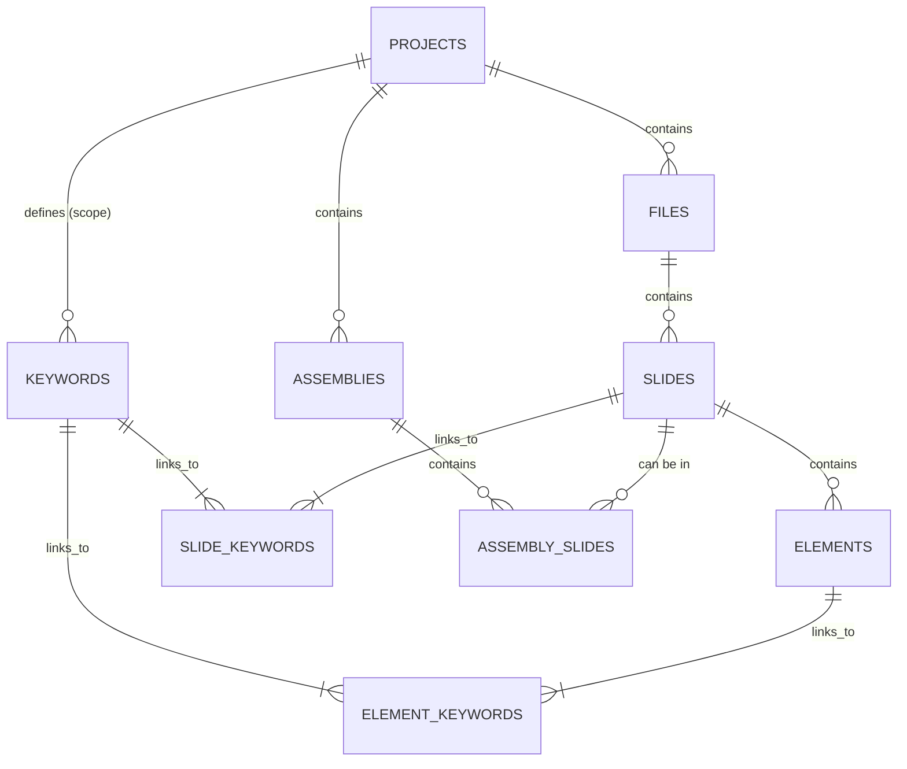

Fantastic. Let's architect the memory of PrezI.

This document will define the precise structure of the application's knowledge base. A clean, efficient, and well-designed database is the unsung hero of a great application, ensuring speed, stability, and scalability. Every piece of information PrezI knows will reside within this structure.

Here is the **PrezI Detailed Database Schema**.

---

# PrezI: Detailed Database Schema

*   **Version:** 1.0
*   **Date:** June 7, 2025
*   **Author:** PrezI Vision Synthesis AI
*   **Status:** Finalized

## 1. Database System Rationale

*   **System:** **SQLite 3**
*   **Rationale:**
    1.  **Serverless & Self-Contained:** The entire database is a single `.db` file that lives alongside the project files. This requires zero configuration for the user and makes the application highly portable.
    2.  **Local-First:** Aligns perfectly with our architecture of keeping all user data on their local machine, ensuring privacy and security.
    3.  **Performance:** SQLite is exceptionally fast for single-user, read-heavy applications like PrezI. With proper indexing, it can handle hundreds of thousands of records with millisecond query times.
    4.  **Full-Text Search (FTS5):** The built-in FTS5 extension provides powerful and instant search capabilities for all extracted slide text, which is critical for the natural language search feature.

## 2. Entity-Relationship Diagram (ERD)

This diagram illustrates the relationships between the core entities in the PrezI database.



**Key Relationships:**
*   A `PROJECT` has many `FILES` and many `KEYWORDS`.
*   A `FILE` has many `SLIDES`.
*   A `SLIDE` has many `ELEMENTS`.
*   `SLIDES` and `KEYWORDS` have a many-to-many relationship, linked through `SLIDE_KEYWORDS`.
*   `ELEMENTS` and `KEYWORDS` have a many-to-many relationship, linked through `ELEMENT_KEYWORDS`.
*   An `ASSEMBLY` is a collection of `ASSEMBLY_SLIDES`, which reference original `SLIDES`.

## 3. Table Definitions (SQL DDL)

Here are the precise `CREATE TABLE` statements that will be used to initialize the database.

### 3.1. Core Structure Tables

```sql
-- Stores high-level project information
CREATE TABLE IF NOT EXISTS projects (
    project_id      INTEGER PRIMARY KEY,
    name            TEXT NOT NULL UNIQUE,
    root_path       TEXT NOT NULL,
    created_at      DATETIME DEFAULT CURRENT_TIMESTAMP
);

-- Stores information about imported PowerPoint files
CREATE TABLE IF NOT EXISTS files (
    file_id         INTEGER PRIMARY KEY,
    project_id      INTEGER NOT NULL,
    original_path   TEXT NOT NULL,
    sanitized_path  TEXT NOT NULL,
    slide_count     INTEGER NOT NULL,
    imported_at     DATETIME DEFAULT CURRENT_TIMESTAMP,
    FOREIGN KEY(project_id) REFERENCES projects(project_id) ON DELETE CASCADE
);

-- Stores information for each individual slide
CREATE TABLE IF NOT EXISTS slides (
    slide_id            INTEGER PRIMARY KEY,
    file_id             INTEGER NOT NULL,
    slide_number_in_file INTEGER NOT NULL,
    title_text          TEXT,
    body_text           TEXT,
    speaker_notes       TEXT,
    thumbnail_path      TEXT NOT NULL, -- Path to the high-res thumbnail image
    ai_topic            TEXT, -- Topic identified by PrezI
    ai_type             TEXT, -- Type identified by PrezI (e.g., 'Data/Chart')
    ai_insight          TEXT, -- Key takeaway identified by PrezI
    created_at          DATETIME DEFAULT CURRENT_TIMESTAMP,
    FOREIGN KEY(file_id) REFERENCES files(file_id) ON DELETE CASCADE,
    UNIQUE(file_id, slide_number_in_file)
);

-- Stores detected elements within a slide
CREATE TABLE IF NOT EXISTS elements (
    element_id      INTEGER PRIMARY KEY,
    slide_id        INTEGER NOT NULL,
    element_type    TEXT NOT NULL, -- e.g., 'chart', 'image', 'textbox'
    bounding_box    TEXT NOT NULL, -- JSON string: '{"x":0, "y":0, "width":0, "height":0}'
    extracted_text  TEXT,
    created_at      DATETIME DEFAULT CURRENT_TIMESTAMP,
    FOREIGN KEY(slide_id) REFERENCES slides(slide_id) ON DELETE CASCADE
);
```

### 3.2. Keyword & Linking Tables

```sql
-- Stores all unique keywords for a project
CREATE TABLE IF NOT EXISTS keywords (
    keyword_id      INTEGER PRIMARY KEY,
    project_id      INTEGER NOT NULL,
    text            TEXT NOT NULL,
    color_hex       TEXT DEFAULT '#e5e7eb', -- Default to secondary text color
    created_at      DATETIME DEFAULT CURRENT_TIMESTAMP,
    FOREIGN KEY(project_id) REFERENCES projects(project_id) ON DELETE CASCADE,
    UNIQUE(project_id, text)
);

-- Many-to-many link between slides and keywords
CREATE TABLE IF NOT EXISTS slide_keywords (
    slide_id        INTEGER NOT NULL,
    keyword_id      INTEGER NOT NULL,
    PRIMARY KEY(slide_id, keyword_id),
    FOREIGN KEY(slide_id) REFERENCES slides(slide_id) ON DELETE CASCADE,
    FOREIGN KEY(keyword_id) REFERENCES keywords(keyword_id) ON DELETE CASCADE
);

-- Many-to-many link between elements and keywords
CREATE TABLE IF NOT EXISTS element_keywords (
    element_id      INTEGER NOT NULL,
    keyword_id      INTEGER NOT NULL,
    PRIMARY KEY(element_id, keyword_id),
    FOREIGN KEY(element_id) REFERENCES elements(element_id) ON DELETE CASCADE,
    FOREIGN KEY(keyword_id) REFERENCES keywords(keyword_id) ON DELETE CASCADE
);
```

### 3.3. Assembly Tables

```sql
-- Stores presentation assemblies
CREATE TABLE IF NOT EXISTS assemblies (
    assembly_id     INTEGER PRIMARY KEY,
    project_id      INTEGER NOT NULL,
    name            TEXT NOT NULL,
    created_at      DATETIME DEFAULT CURRENT_TIMESTAMP,
    FOREIGN KEY(project_id) REFERENCES projects(project_id) ON DELETE CASCADE
);

-- Stores the slides within an assembly, preserving their order
CREATE TABLE IF NOT EXISTS assembly_slides (
    assembly_slide_id   INTEGER PRIMARY KEY,
    assembly_id         INTEGER NOT NULL,
    slide_id            INTEGER NOT NULL,
    slide_order         INTEGER NOT NULL, -- The position of the slide in the assembly
    FOREIGN KEY(assembly_id) REFERENCES assemblies(assembly_id) ON DELETE CASCADE,
    FOREIGN KEY(slide_id) REFERENCES slides(slide_id) ON DELETE CASCADE
);
```

## 4. Full-Text Search (FTS5)

To enable lightning-fast natural language search across all slide content, we will use a virtual FTS5 table.

```sql
-- Create a virtual table optimized for full-text search
CREATE VIRTUAL TABLE IF NOT EXISTS slides_fts USING fts5(
    title_text,
    body_text,
    speaker_notes,
    ai_topic,
    ai_insight,
    content='slides', -- Reference to the main slides table
    content_rowid='slide_id' -- Links each FTS record to a slide_id
);

-- Triggers to keep the FTS table in sync with the main slides table
CREATE TRIGGER IF NOT EXISTS slides_after_insert AFTER INSERT ON slides BEGIN
  INSERT INTO slides_fts(rowid, title_text, body_text, speaker_notes, ai_topic, ai_insight)
  VALUES (new.slide_id, new.title_text, new.body_text, new.speaker_notes, new.ai_topic, new.ai_insight);
END;

CREATE TRIGGER IF NOT EXISTS slides_after_delete AFTER DELETE ON slides BEGIN
  INSERT INTO slides_fts(slides_fts, rowid, title_text, body_text, speaker_notes, ai_topic, ai_insight)
  VALUES ('delete', old.slide_id, old.title_text, old.body_text, old.speaker_notes, old.ai_topic, old.ai_insight);
END;

CREATE TRIGGER IF NOT EXISTS slides_after_update AFTER UPDATE ON slides BEGIN
  INSERT INTO slides_fts(slides_fts, rowid, title_text, body_text, speaker_notes, ai_topic, ai_insight)
  VALUES ('delete', old.slide_id, old.title_text, old.body_text, old.speaker_notes, old.ai_topic, old.ai_insight);
  INSERT INTO slides_fts(rowid, title_text, body_text, speaker_notes, ai_topic, ai_insight)
  VALUES (new.slide_id, new.title_text, new.body_text, new.speaker_notes, new.ai_topic, new.ai_insight);
END;
```

## 5. Indexing Strategy

To ensure high performance, especially as projects grow, the following indexes are critical.

```sql
-- For fast lookup of files within a project
CREATE INDEX IF NOT EXISTS idx_files_project_id ON files(project_id);

-- For fast lookup of slides within a file
CREATE INDEX IF NOT EXISTS idx_slides_file_id ON slides(file_id);

-- For fast lookup of elements within a slide
CREATE INDEX IF NOT EXISTS idx_elements_slide_id ON elements(slide_id);

-- For fast keyword searches and joins
CREATE INDEX IF NOT EXISTS idx_keywords_project_id ON keywords(project_id);
CREATE INDEX IF NOT EXISTS idx_slide_keywords_keyword_id ON slide_keywords(keyword_id);
CREATE INDEX IF NOT EXISTS idx_element_keywords_keyword_id ON element_keywords(keyword_id);

-- For fast lookup of slides within an assembly
CREATE INDEX IF NOT EXISTS idx_assembly_slides_assembly_id ON assembly_slides(assembly_id);
```

This database schema provides a robust, efficient, and scalable foundation for all of PrezI's data storage and retrieval needs. It is designed for performance and integrity, ensuring the application remains fast and reliable as users build their slide universes.