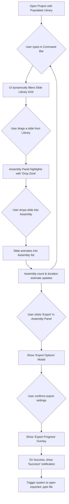

# PrezI: Comprehensive Founders Briefcase - Consolidated Knowledge Base

*Consolidated from 13 source documents on June 8, 2025*  
*Version: 2.0 - Complete Master Reference*  
*Status: Verified Complete - All Source Content Integrated*

---

## Table of Contents

1. [Executive Summary & Vision](#1-executive-summary--vision)
2. [Technical Architecture](#2-technical-architecture)
3. [AI Intelligence Design](#3-ai-intelligence-design)
4. [User Experience Design](#4-user-experience-design)
5. [Development & Operations Guide](#5-development--operations-guide)
6. [Technical Implementation Guide](#6-technical-implementation-guide)
7. [Complete UI/UX Specifications](#7-complete-uiux-specifications)
8. [Operations Manual](#8-operations-manual)
9. [Enhancement Roadmap](#9-enhancement-roadmap)
10. [Quick Reference](#10-quick-reference)

---

## 1. Executive Summary & Vision

### 1.1 The Problem: Presentation Purgatory
Every day, millions of professionals waste 4-5 hours searching through dozens of PowerPoint files, hunting for that perfect slide. They copy-paste slides into new decks, creating visual Frankenstein monsters with clashing fonts, inconsistent colors, and misaligned logos. This is a **$50 billion drain on productivity**.

### 1.2 The Solution: PrezI
**PrezI is an intelligent manager for your entire slide universe.** She understands the content inside every slide, learns your style, maintains your brand, and helps you craft compelling stories from your best work—in minutes, not hours.

### 1.3 Core Value Proposition
Transform the chaos into a clear, searchable library and turn your intent into a professional presentation:

> **"I need a pitch for the BigCorp investors. Focus on our Q4 results and our growth strategy for 2025."**

PrezI responds with a step-by-step plan, executes automatically, and delivers a professional, branded presentation ready for the boardroom.

### 1.4 Complete Feature Set

#### SlideMan: The Professional Workspace
- **Project & File Management**: Create projects, bulk import `.pptx` files, unified slide library
- **Interactive Organization**: Manual slide tagging, element-level tagging, keyword management, live filtering
- **Manual Assembly**: Click-to-assemble, drag-and-drop reordering, clear assembly
- **Export & Output**: Export to `.pptx`/`.pdf`, custom naming, auto-launch

#### PrezI: The AI Partner
- **Content Intelligence**: Automated slide analysis, auto-tagging, keyword suggestions
- **AI-Driven Search**: Natural language search, global cross-project search
- **Automated Creation**: Intent-to-plan conversion, automated assembly execution
- **Professional Polish**: Style harmonization, consistent branding
- **Proactive Partnership**: Contextual suggestions, user-friendly error handling

#### User Experience & Platform
- **First-Time Experience**: Welcome screens, API key setup, guided tours, personalized completion
- **Platform Support**: Windows-first with COM automation, cross-platform roadmap
- **Security & Configuration**: OS-native credential storage, user-friendly settings, robust logging

---

## 2. Technical Architecture

### 2.1 Architectural Vision: "Best of Both Worlds" Hybrid
- **Native Power**: Unrestricted local file access, direct PowerPoint COM integration
- **Web-First Experience**: Fluid, beautiful UI matching high-fidelity mockups

### 2.2 System Architecture

```
┌─────────────────────────────────────────────────────────────────┐
│                        USER'S COMPUTER                         │
│                                                                 │
│ ┌─────────────────┐  ┌─────────────────┐  ┌─────────────────┐ │
│ │ Electron Shell  │  │ PowerPoint/COM  │  │    OpenAI API   │ │
│ │   (Wrapper)     │  │   (Automation)  │  │   (Intelligence)│ │
│ └─────────────────┘  └─────────────────┘  └─────────────────┘ │
│ │                                                             │ │
│ │ ┌─────────────────────────────────────────────────────────┐ │ │
│ │ │              Frontend UI (The Cockpit)                  │ │ │
│ │ │                HTML, CSS, JavaScript                    │ │ │
│ │ └─────────────────────────────────────────────────────────┘ │ │
│ │                           ↕ HTTP/WebSocket                 │ │
│ │ ┌─────────────────────────────────────────────────────────┐ │ │
│ │ │            Python Backend (The Engine)                  │ │ │
│ │ │        FastAPI + Core Services + Database               │ │ │
│ │ └─────────────────────────────────────────────────────────┘ │ │
│ └─────────────────────────────────────────────────────────────┘ │
└─────────────────────────────────────────────────────────────────┘
```

### 2.3 Technology Stack

| Layer | Technology | Rationale |
|-------|------------|-----------|
| **Desktop Wrapper** | Electron | Cross-platform, mature, excellent community support |
| **UI Frontend** | HTML5, CSS3, JavaScript | Guarantees exact mockup look and feel |
| **Communication** | FastAPI (Python) | High-performance, async-native, auto-documentation |
| **Backend Engine** | Python 3.10+ | Robust AI libraries, SQLite support, matches PoC |
| **Database** | SQLite + FTS5 | Serverless, zero-config, perfect for local-first |
| **AI Services** | OpenAI API (GPT-4o, o3) | State-of-the-art NLP and reasoning |
| **Office Integration** | pywin32 (COM) | Standard for direct Microsoft Office control |

### 2.4 Project Structure

```
prezi_app/
├── main.js                 # Electron entry point
├── package.json           # Node.js dependencies
├── docs/                  # Complete planning documents
├── backend/               # Python Engine
│   ├── main.py           # FastAPI server entry
│   ├── api/v1/           # API endpoints
│   ├── core/             # Business logic services
│   ├── database/         # Database management
│   └── tests/            # Backend tests
└── frontend/             # Web UI
    ├── index.html        # Single page application
    ├── styles/           # CSS files
    ├── scripts/          # JavaScript modules
    └── assets/           # Static resources
```

### 2.5 Database Schema (SQLite)

**Core Tables:**
- `projects`: Project metadata and organization
- `files`: Imported PowerPoint file tracking
- `slides`: Individual slide content and analysis
- `elements`: Slide element detection and tagging
- `keywords`: Tag management and organization
- `assemblies`: Presentation assembly state

**Advanced Features:**
- `slides_fts`: Full-text search using FTS5
- `onboarding_state`: First-time user experience tracking
- `user_settings`: Application configuration
- `api_credentials`: Secure OpenAI key management

**Complete Database Schema (SQLite + FTS5):**

```sql
-- Core Structure Tables
CREATE TABLE IF NOT EXISTS projects (
    project_id      INTEGER PRIMARY KEY,
    name            TEXT NOT NULL UNIQUE,
    root_path       TEXT NOT NULL,
    created_at      DATETIME DEFAULT CURRENT_TIMESTAMP
);

CREATE TABLE IF NOT EXISTS files (
    file_id         INTEGER PRIMARY KEY,
    project_id      INTEGER NOT NULL,
    original_path   TEXT NOT NULL,
    sanitized_path  TEXT NOT NULL,
    slide_count     INTEGER NOT NULL,
    imported_at     DATETIME DEFAULT CURRENT_TIMESTAMP,
    FOREIGN KEY(project_id) REFERENCES projects(project_id) ON DELETE CASCADE
);

CREATE TABLE IF NOT EXISTS slides (
    slide_id            INTEGER PRIMARY KEY,
    file_id             INTEGER NOT NULL,
    slide_number_in_file INTEGER NOT NULL,
    title_text          TEXT,
    body_text           TEXT,
    speaker_notes       TEXT,
    thumbnail_path      TEXT NOT NULL,
    ai_topic            TEXT,
    ai_type             TEXT,
    ai_insight          TEXT,
    created_at          DATETIME DEFAULT CURRENT_TIMESTAMP,
    FOREIGN KEY(file_id) REFERENCES files(file_id) ON DELETE CASCADE,
    UNIQUE(file_id, slide_number_in_file)
);

CREATE TABLE IF NOT EXISTS elements (
    element_id      INTEGER PRIMARY KEY,
    slide_id        INTEGER NOT NULL,
    element_type    TEXT NOT NULL,
    bounding_box    TEXT NOT NULL,
    extracted_text  TEXT,
    created_at      DATETIME DEFAULT CURRENT_TIMESTAMP,
    FOREIGN KEY(slide_id) REFERENCES slides(slide_id) ON DELETE CASCADE
);

-- Keyword & Linking Tables
CREATE TABLE IF NOT EXISTS keywords (
    keyword_id      INTEGER PRIMARY KEY,
    project_id      INTEGER NOT NULL,
    text            TEXT NOT NULL,
    color_hex       TEXT DEFAULT '#e5e7eb',
    created_at      DATETIME DEFAULT CURRENT_TIMESTAMP,
    FOREIGN KEY(project_id) REFERENCES projects(project_id) ON DELETE CASCADE,
    UNIQUE(project_id, text)
);

CREATE TABLE IF NOT EXISTS slide_keywords (
    slide_id        INTEGER NOT NULL,
    keyword_id      INTEGER NOT NULL,
    PRIMARY KEY(slide_id, keyword_id),
    FOREIGN KEY(slide_id) REFERENCES slides(slide_id) ON DELETE CASCADE,
    FOREIGN KEY(keyword_id) REFERENCES keywords(keyword_id) ON DELETE CASCADE
);

CREATE TABLE IF NOT EXISTS element_keywords (
    element_id      INTEGER NOT NULL,
    keyword_id      INTEGER NOT NULL,
    PRIMARY KEY(element_id, keyword_id),
    FOREIGN KEY(element_id) REFERENCES elements(element_id) ON DELETE CASCADE,
    FOREIGN KEY(keyword_id) REFERENCES keywords(keyword_id) ON DELETE CASCADE
);

-- Assembly Tables
CREATE TABLE IF NOT EXISTS assemblies (
    assembly_id     INTEGER PRIMARY KEY,
    project_id      INTEGER NOT NULL,
    name            TEXT NOT NULL,
    created_at      DATETIME DEFAULT CURRENT_TIMESTAMP,
    FOREIGN KEY(project_id) REFERENCES projects(project_id) ON DELETE CASCADE
);

CREATE TABLE IF NOT EXISTS assembly_slides (
    assembly_slide_id   INTEGER PRIMARY KEY,
    assembly_id         INTEGER NOT NULL,
    slide_id            INTEGER NOT NULL,
    slide_order         INTEGER NOT NULL,
    FOREIGN KEY(assembly_id) REFERENCES assemblies(assembly_id) ON DELETE CASCADE,
    FOREIGN KEY(slide_id) REFERENCES slides(slide_id) ON DELETE CASCADE
);

-- Full-Text Search (FTS5)
CREATE VIRTUAL TABLE IF NOT EXISTS slides_fts USING fts5(
    title_text, body_text, speaker_notes, ai_topic, ai_insight,
    content='slides', content_rowid='slide_id'
);

-- FTS5 Sync Triggers
CREATE TRIGGER IF NOT EXISTS slides_after_insert AFTER INSERT ON slides BEGIN
  INSERT INTO slides_fts(rowid, title_text, body_text, speaker_notes, ai_topic, ai_insight)
  VALUES (new.slide_id, new.title_text, new.body_text, new.speaker_notes, new.ai_topic, new.ai_insight);
END;

CREATE TRIGGER IF NOT EXISTS slides_after_delete AFTER DELETE ON slides BEGIN
  INSERT INTO slides_fts(slides_fts, rowid, title_text, body_text, speaker_notes, ai_topic, ai_insight)
  VALUES ('delete', old.slide_id, old.title_text, old.body_text, old.speaker_notes, old.ai_topic, old.ai_insight);
END;

CREATE TRIGGER IF NOT EXISTS slides_after_update AFTER UPDATE ON slides BEGIN
  INSERT INTO slides_fts(slides_fts, rowid, title_text, body_text, speaker_notes, ai_topic, ai_insight)
  VALUES ('delete', old.slide_id, old.title_text, old.body_text, old.speaker_notes, old.ai_topic, old.ai_insight);
  INSERT INTO slides_fts(rowid, title_text, body_text, speaker_notes, ai_topic, ai_insight)
  VALUES (new.slide_id, new.title_text, new.body_text, new.speaker_notes, new.ai_topic, new.ai_insight);
END;

-- User Experience & Onboarding Tables
CREATE TABLE IF NOT EXISTS user_settings (
    setting_id      INTEGER PRIMARY KEY,
    setting_key     TEXT NOT NULL UNIQUE,
    setting_value   TEXT NOT NULL,
    updated_at      DATETIME DEFAULT CURRENT_TIMESTAMP
);

CREATE TABLE IF NOT EXISTS api_credentials (
    credential_id       INTEGER PRIMARY KEY,
    service_name        TEXT NOT NULL UNIQUE,
    credential_status   TEXT NOT NULL,
    last_validated      DATETIME,
    models_available    TEXT,
    updated_at          DATETIME DEFAULT CURRENT_TIMESTAMP
);

CREATE TABLE IF NOT EXISTS onboarding_state (
    onboarding_id       INTEGER PRIMARY KEY,
    completed           BOOLEAN DEFAULT 0,
    current_state       TEXT NOT NULL DEFAULT 'WELCOME',
    branch_path         TEXT,
    progression         INTEGER DEFAULT 0,
    started_at          DATETIME DEFAULT CURRENT_TIMESTAMP,
    completed_at        DATETIME,
    last_updated        DATETIME DEFAULT CURRENT_TIMESTAMP
);

CREATE TABLE IF NOT EXISTS onboarding_transitions (
    transition_id       INTEGER PRIMARY KEY,
    onboarding_id       INTEGER NOT NULL,
    from_state          TEXT NOT NULL,
    to_state            TEXT NOT NULL,
    transition_type     TEXT NOT NULL,
    time_spent_ms       INTEGER,
    transition_timestamp DATETIME DEFAULT CURRENT_TIMESTAMP,
    FOREIGN KEY(onboarding_id) REFERENCES onboarding_state(onboarding_id) ON DELETE CASCADE
);

CREATE TABLE IF NOT EXISTS onboarding_content (
    content_id          INTEGER PRIMARY KEY,
    state_name          TEXT NOT NULL,
    branch_path         TEXT,
    title               TEXT NOT NULL,
    content_html        TEXT NOT NULL,
    ui_highlights       TEXT,
    primary_action      TEXT NOT NULL,
    secondary_actions   TEXT,
    version             INTEGER DEFAULT 1,
    UNIQUE(state_name, branch_path)
);

CREATE TABLE IF NOT EXISTS onboarding_actions (
    action_id           INTEGER PRIMARY KEY,
    onboarding_id       INTEGER NOT NULL,
    current_state       TEXT NOT NULL,
    action_type         TEXT NOT NULL,
    feature_context     TEXT,
    action_data         TEXT,
    action_timestamp    DATETIME DEFAULT CURRENT_TIMESTAMP,
    FOREIGN KEY(onboarding_id) REFERENCES onboarding_state(onboarding_id) ON DELETE CASCADE
);

CREATE TABLE IF NOT EXISTS onboarding_assistant (
    interaction_id      INTEGER PRIMARY KEY,
    onboarding_id       INTEGER NOT NULL,
    state_name          TEXT NOT NULL,
    user_query          TEXT,
    assistant_response  TEXT NOT NULL,
    feature_context     TEXT,
    interaction_timestamp DATETIME DEFAULT CURRENT_TIMESTAMP,
    FOREIGN KEY(onboarding_id) REFERENCES onboarding_state(onboarding_id) ON DELETE CASCADE
);

-- Performance Indexes
CREATE INDEX IF NOT EXISTS idx_files_project_id ON files(project_id);
CREATE INDEX IF NOT EXISTS idx_slides_file_id ON slides(file_id);
CREATE INDEX IF NOT EXISTS idx_elements_slide_id ON elements(slide_id);
CREATE INDEX IF NOT EXISTS idx_keywords_project_id ON keywords(project_id);
CREATE INDEX IF NOT EXISTS idx_slide_keywords_keyword_id ON slide_keywords(keyword_id);
CREATE INDEX IF NOT EXISTS idx_element_keywords_keyword_id ON element_keywords(keyword_id);
CREATE INDEX IF NOT EXISTS idx_assembly_slides_assembly_id ON assembly_slides(assembly_id);
CREATE INDEX IF NOT EXISTS idx_onboarding_actions_onboarding_id ON onboarding_actions(onboarding_id);
CREATE INDEX IF NOT EXISTS idx_onboarding_actions_state ON onboarding_actions(current_state);
CREATE INDEX IF NOT EXISTS idx_onboarding_transitions_onboarding_id ON onboarding_transitions(onboarding_id);
CREATE INDEX IF NOT EXISTS idx_onboarding_assistant_onboarding_id ON onboarding_assistant(onboarding_id);
```

### 2.6 API Specification

**Base URL:** `http://127.0.0.1:8765/api/v1`

**Core Endpoints:**
- `POST/GET /projects` - Project management
- `POST /projects/{id}/import` - File import (async)
- `GET /slides` - Slide retrieval with filtering
- `POST /slides/{id}/keywords` - Keyword assignment
- `GET/POST/PUT/DELETE /assembly` - Assembly management
- `POST /prezi/interpret` - AI intent analysis
- `POST /prezi/plan` - Visual plan generation
- `POST /prezi/execute` - Plan execution (async)
- `POST /export` - Presentation export (async)

**Onboarding API:**
- `GET/PUT /onboarding/state` - State machine management
- `GET /onboarding/content` - Dynamic content delivery
- `POST /auth/validate-api-key` - API key validation

**Real-time Communication:**
- WebSocket: `ws://127.0.0.1:8765/ws`
- Events: `TASK_PROGRESS`, `PREZI_SUGGESTION`, `LIBRARY_UPDATED`

---

## 3. AI Intelligence Design

### 3.1 PrezI's Cognitive Model: The OODA Loop

1. **Observe**: Context awareness (selected slides, command bar input, assembly state)
2. **Orient**: Natural language processing and intent understanding
3. **Decide**: Visual plan formulation with Human-in-the-Loop approval
4. **Act**: Step-by-step execution with real-time feedback

### 3.2 Personality Matrix: "The Brilliant Partner"

| Situation | Tone | Example |
|-----------|------|---------|
| **Greeting/Idle** | Professional, Ready | "Ready to build something brilliant." |
| **Receiving Command** | Attentive, Focused | "Understood. Analyzing your request for 'investor pitch'..." |
| **Presenting Plan** | Confident, Clear | "Here is my proposed 4-step plan. Review and approve." |
| **Executing Task** | Energetic, Focused | "✨ Finding the best revenue charts now..." |
| **Task Success** | Celebratory, Encouraging | "Done! Your presentation is ready. You're going to impress." |
| **Error Handling** | Analytical, Reassuring | "The API timed out. No worries. Let's try that again." |

### 3.3 Complete Master Prompt Library

#### ANALYZE_SLIDE_CONTENT (GPT-4o - Content Understanding)
**Goal**: Extract structured metadata from slide text content during import
**Trigger**: For each slide during conversion process
**System Prompt**:
```
You are a world-class presentation analyst. Your task is to analyze the provided slide content and return a structured JSON object. Be concise and precise.
```
**User Prompt**:
```json
Analyze the following slide content and return a single, minified JSON object with no markdown formatting.

Slide Content:
{
  "title": "${slide_title}",
  "body_text": "${slide_body_text}",
  "speaker_notes": "${slide_speaker_notes}"
}

JSON Schema to follow:
{
  "slide_topic": "A brief, 3-5 word topic for the slide.",
  "slide_type": "Categorize as one of: 'Title', 'Agenda', 'Problem', 'Solution', 'Data/Chart', 'Quote', 'Team', 'Summary', 'Call to Action', 'Other'.",
  "sentiment": "'Positive', 'Negative', or 'Neutral'.",
  "keywords": ["An array of 5-7 relevant keywords extracted from the content."],
  "key_insight": "A single sentence summarizing the main takeaway of the slide."
}
```

#### INTERPRET_USER_INTENT (GPT-4o - Command Translation)
**Goal**: Convert natural language commands into structured actionable requests
**Trigger**: When user types in universal command bar
**System Prompt**:
```
You are an expert system that translates natural language commands into structured JSON. Your task is to understand the user's goal and extract key parameters.
```
**User Prompt**:
```json
Analyze the user's command and the current application context. Return a single, minified JSON object representing their intent.

User Command: "${user_command}"

Application Context:
{
  "available_slide_types": ["Title", "Agenda", "Problem", "Solution", "Data/Chart", "Quote", "Team", "Summary", "Call to Action"],
  "available_keywords": ["${keyword_list}"]
}

JSON Schema to follow:
{
  "primary_action": "Categorize the user's main goal. Must be one of: 'FIND', 'CREATE', 'ANALYZE', 'EDIT'.",
  "search_parameters": {
    "keywords": ["List of keywords to search for."],
    "slide_types": ["List of slide types to include."],
    "date_range": "e.g., 'Q4 2024', 'last month', 'null'."
  },
  "creation_parameters": {
    "presentation_topic": "The topic of the new presentation.",
    "target_audience": "e.g., 'investors', 'new clients', 'internal team'.",
    "presentation_length_minutes": "Estimated length in minutes, or null."
  },
  "analysis_target": "The target of the analysis, e.g., 'current_assembly', 'all_slides'."
}
```

#### GENERATE_VISUAL_PLAN (o3 - Strategic Planning)
**Goal**: Create step-by-step execution plan based on interpreted user intent
**Trigger**: After INTERPRET_USER_INTENT succeeds with CREATE or EDIT action
**System Prompt**:
```
You are a world-class presentation strategist. Given a user's goal, you create a logical, step-by-step plan to build a compelling presentation. Your plans are clear, concise, and instill confidence.
```
**User Prompt**:
```json
Based on the user's structured intent, create a step-by-step plan to build their presentation. The plan should be an array of "step" objects. Each step must have a 'title' and a 'details' field. The plan should not exceed 10 steps. Return a single, minified JSON object.

Structured User Intent:
${structured_intent_json}

JSON Schema to follow:
{
  "plan": [
    {
      "title": "A short, actionable title for the step (e.g., 'Find Opening Hook').",
      "details": "A brief description of what will be done in this step (e.g., 'Searching for high-impact title and agenda slides.').",
      "backend_action": {
        "function_name": "Name of the Python function to call for this step (e.g., 'find_slides_by_type').",
        "parameters": { "param1": "value1" }
      }
    }
  ]
}
```

#### ONBOARDING_ASSISTANT (GPT-4o - Personalized Guidance)
**Goal**: Provide conversational guidance through first-time user experience
**Trigger**: During onboarding flow or when explicitly requested
**System Prompt**:
```
You are PrezI's helpful onboarding assistant. Your goal is to introduce the user to PrezI's core features in under five minutes, explaining each concept briefly and clearly. Be encouraging and cheerful, but respect the user's time. Guide them through the current onboarding step, focusing on making them successful quickly.
```
**User Prompt**:
```json
Generate a brief, conversational guidance message for the current onboarding step. Keep it under 60 words. Be specific to the current feature being demonstrated.

Current Step: "${current_onboarding_step}"
Feature Context: "${feature_description}"
User Actions So Far: ${user_actions_json}

Response should include:
1. A warm, brief greeting (if this is the first step)
2. A clear, direct explanation of the current feature
3. A specific instruction on what to do next
```

#### Confidence Threshold Decision Logic
```python
# Pseudocode for slide selection with confidence scoring
def select_best_slide(slides, context):
    for slide in slides:
        slide.score = calculate_relevance_score(slide, context)
    
    sorted_slides = sorted(slides, key=lambda s: s.score, reverse=True)
    best_slide = sorted_slides[0]
    
    if best_slide.score < 0.75:  # Confidence Threshold
        # If not confident, ask for clarification
        prezi_ask_clarification(
            "I found a few options, but none seem perfect. Which of these is closest to what you need?", 
            options=sorted_slides[:3]
        )
    else:
        # If confident, proceed
        assembly.add_slide(best_slide)
```

### 3.4 Onboarding State Machine

**States:** WELCOME → API_SETUP → BRANCH_CHOICE → [FEATURE_TOUR | IMPORT_FIRST] → COMMAND_BAR → ASSEMBLY_PANEL → AI_ASSISTANT → GRADUATION → COMPLETED

**Branching Paths:**
- **Feature-First**: Showcases capabilities before hands-on usage
- **Import-First**: Immediate hands-on approach for practical users

**Analytics Tracking:**
- Completion rates, time-to-value, drop-off points
- User action patterns for personalized assistance
- Difficulty signals for continuous improvement

---

## 4. User Experience Design

### 4.1 Design Philosophy: "Living Workspace"
- **Clarity in Darkness**: Dark theme makes colorful slides the hero
- **Fluid & Responsive**: Smooth 60fps animations and immediate feedback
- **Professionalism with Personality**: Clean aesthetic with signature purple/blue gradients
- **Content-First Focus**: Tools remain hidden until needed
- **Immersive & Focused**: Minimal UI chrome, maximum content space

### 4.2 Color Palette

**Primary Colors:**
- Background: `#0a0a0a` (deep focus)
- Panel: `#1a1a1a` (containers)
- Cards: `#2a2a2a` (interactive elements)
- Borders: `#3a3a3a` (dividers)

**Text Hierarchy:**
- Primary: `#ffffff` (titles)
- Secondary: `#e5e7eb` (descriptions)
- Muted: `#9ca3af` (metadata)

**Brand Gradients:**
- Primary: `linear-gradient(135deg, #667eea, #764ba2)`
- Purple Accent: `#a855f7`
- Blue Accent: `#3b82f6`

**State Colors:**
- Success: `#10b981`
- Warning: `#f59e0b`
- Error: `#ef4444`

### 4.3 Typography
- **Font Stack**: `-apple-system, BlinkMacSystemFont, 'Segoe UI', Roboto, sans-serif`
- **Scale**: 48px (Display) → 36px (Section) → 24px (Subsection) → 20px (Small Title) → 16px (Body) → 14px (Secondary) → 12px (Caption)
- **Grid System**: 8px base unit for consistent spacing

### 4.4 Key UI Components

**Buttons:**
- Primary CTA: Gradient background with shadow and hover lift
- Secondary: Transparent with border, hover highlight
- States: Smooth transitions with cubic-bezier easing

**Cards:**
- Slide cards: Rounded corners, hover lift animation
- Keyword pills: Rounded, subtle hover slide
- Selection: 2px colored border for active states

**Command Bar:**
- Central interaction point with focus ring
- Placeholder text cycling through example queries
- Real-time search result filtering

**PrezI Avatar:**
- Gradient core with floating animation
- Morphing inner "soul" shape
- Particle effects during AI thinking states

### 4.5 User Flow Diagrams

**First-Time Setup:**
Start → Empty State → Create Project → Import Files → Progress → Populated Library → Help Tips

**Core Workflow Loop:**
Search Command → Filter Results → Drag to Assembly → Update Count → Export Options → Progress → Success

**AI Magic Moment:**
Intent Command → Visual Plan Modal → User Approval → Execution Progress → Real-time Assembly → Celebration

### 4.6 Screen Specifications

**Main Workspace Layout:**
- Header: 72px with logo, command bar, status
- Left Sidebar: 280px (keywords, project info)
- Right Sidebar: 320px (assembly panel)
- Main Content: Responsive grid of slide cards

**Modal Behaviors:**
- Fade in with scale-up animation (0.3s)
- Backdrop blur for focus
- Clear primary actions with visual hierarchy

**Progress Indicators:**
- Non-intrusive for background tasks
- Prominent modal for primary AI actions
- Step-by-step visual feedback

---

## 5. Development & Operations Guide

### 5.1 Development Philosophy
- **Document-Driven**: All specs are single source of truth
- **Incremental & Verifiable**: Testable sprints with clear deliverables
- **Component-Based**: Modular, reusable architecture
- **Quality Paramount**: Comprehensive Definition of Done
- **Explicit State**: All project state in committed code and docs

### 5.2 Agent Handover Protocol

**End-of-Session Procedure:**
1. **Commit Code**: Follow semantic commit format with task IDs
2. **Run All Tests**: Execute complete test suite and document results
3. **Update Master Plan**: Mark completed tasks with checkmarks
4. **Generate Handover Note**: Structured summary for next session

**Start-of-Session Procedure:**
1. **Verify Environment**: Ensure dependencies are installed
2. **Review Key Documents**: Current plan, handover notes, relevant specs
3. **Run All Tests**: Verify clean starting state
4. **Acknowledge Status**: Confirm understanding of current progress
5. **Proceed with Next Task**: Begin next unchecked item

### 5.3 Phased Development Plan

**Phase 1: Functional Core (MVP)**
- Sprint 0: Foundation & setup (Electron + FastAPI bridge)
- Sprint 1: Database & models (SQLite schema implementation)
- Sprint 2: File import & processing (COM automation)
- Sprint 3: Slide library UI (responsive grid, filtering)
- Sprint 4: Manual tagging & search (keyword management)
- Sprint 5: Assembly & export (drag-drop, PowerPoint generation)
- Sprint 6: Onboarding experience (state machine, guided tour)

**Phase 2: Intelligent Assistant**
- PrezI core integration (OpenAI API connection)
- AI-powered semantic search
- Proactive suggestions & auto-tagging

**Phase 3: Automated Partner**
- Visual plan workflow
- Automated presentation engine
- Style harmonization magic

### 5.4 Testing Strategy (Testing Pyramid)

**Unit Tests (Foundation):**
- Backend: `pytest` for all Python functions
- Frontend: `Jest` for JavaScript modules

**Integration Tests (Mid-level):**
- API endpoint testing with real data
- Database operation validation
- Cross-component interaction verification

**End-to-End Tests (Peak):**
- Playwright automation for complete user workflows
- Full import → search → assemble → export cycles
- AI interaction and response validation

### 5.5 Definition of Done
1. **Code Complete**: Adheres to best practices
2. **Functionality Met**: Works per PRD specifications
3. **Design Adherence**: Pixel-perfect UI implementation
4. **API Contract Fulfilled**: Matches specification exactly
5. **Database Integrity**: Correct schema compliance
6. **AI Logic Implemented**: Follows AIDD rules and prompts
7. **Testing Passed**: 100% test success rate
8. **No Regressions**: Existing features remain functional

### 5.6 Configuration Management

**API Key Security:**
- OS-native credential store (Windows Credential Manager)
- Never stored in plaintext files
- Immediate validation with user feedback
- Secure rotation capabilities

**Application Settings:**
- Default project directory configuration
- PrezI personality style selection
- Cache management and troubleshooting tools
- Export format preferences

### 5.7 Logging & Diagnostics

**Log Structure:**
- JSON format for easy parsing
- 7-day rotation in user AppData directory
- INFO level by default with configurable levels

**Key Events Logged:**
- Application lifecycle (start/shutdown)
- Project operations (create/load)
- Import/export processes
- OpenAI API interactions (masked keys)
- Error conditions and exceptions

### 5.8 Error Handling Dictionary

| Error Code | User Message |
|------------|--------------|
| `INVALID_API_KEY` | "It seems my API key isn't quite right. Could you please double-check it in Settings?" |
| `API_RATE_LIMIT` | "Looks like we're thinking too fast! Let's try again in a few moments." |
| `COM_AUTOMATION_FAILURE` | "I can't communicate with PowerPoint. Please ensure it's installed correctly." |
| `FILE_IMPORT_FAILED` | "I had trouble with `[filename]`. It might be corrupted. Shall I skip it?" |
| `NO_SEARCH_RESULTS` | "Couldn't find anything matching `[query]`. Try different keywords?" |

---

## 6. Technical Implementation Guide

### 6.1 Agent Handover Protocol (Critical for Project Continuity)

#### End-of-Session Procedure: "The Commit & Handover"
Before ending any work session, the current AI agent **must** perform these steps:

1. **Commit Code**: All newly created or modified files must be committed to version control
   - Format: `feat(scope): Description (Task X.Y)` for new features
   - Format: `fix(scope): Description (Task X.Y)` for bug fixes
   - Example: `feat(api): Implement GET /slides endpoint (Task 3.1)`

2. **Run All Tests**: Execute the entire test suite and paste summary output
   - Proof that new code is correct and no regressions introduced
   - Work is not complete if any test fails

3. **Update Master Plan**: Edit the Development & Testing Plan document
   - Place checkmark (`✅`) next to completed Task ID(s)
   - Update status and verification notes

4. **Generate Handover Note**: Conclude session with structured note:
   ```
   ---
   **HANDOVER NOTE**
   **Session Summary:** Brief one-sentence summary of work accomplished
   **Last Task Completed:** Task X.Y - [Task Description]
   **Verification:** All tests passed successfully [Link to results]
   **Next Task:** Task X.Z - [Task Description]
   **Notes & Challenges:** [Important context for next agent]
   ---
   ```

#### Start-of-Session Procedure: "The Wake-Up & Onboard"
To begin a new work session, any new AI agent **must** perform these steps:

1. **Verify Environment**: Ensure development environment is correctly set up
   - Run `pip install -r requirements.txt` for backend dependencies
   - Verify all required tools are available

2. **Review Key Documents** in this specific order:
   - This Development & Testing Plan (current progress state)
   - Handover Note from previous agent's session
   - Specific design/spec documents relevant to next assigned task

3. **Run All Tests**: Execute entire test suite to verify clean, working state
   - Builds trust in previous agent's work
   - Identifies any environmental issues

4. **Acknowledge Current State**: Begin work with confirmation statement
   - Example: "I have successfully onboarded. Last completed task was 3.1. All tests passing. Beginning work on Task 3.2: Implement UI for Main Content Area."

5. **Proceed with Next Task**: Begin development on next unchecked task

### 6.2 Detailed Sprint Breakdown with Task IDs

#### Sprint 0: Project Foundation & Environment Setup
| Task ID | Description | Key Documents | Status |
|---------|-------------|---------------|---------|
| ☐ **0.1** | Initialize project directory with frontend/backend structure | SAD, Project Layout | |
| ☐ **0.2** | Set up Electron project, configure main.js for main window | SAD | |
| ☐ **0.3** | Configure main window to load frontend/index.html on startup | SAD, Design System | |
| ☐ **0.4** | Implement Python backend launcher in Electron (start/terminate) | SAD | |
| ☐ **0.5** | Establish WebSocket communication bridge with "connected" test | SAD, API Spec | |

#### Sprint 1: Database & Core Models
| Task ID | Description | Key Documents | Status |
|---------|-------------|---------------|---------|
| ☐ **1.1** | Create SQLite database initialization script | Database Schema | |
| ☐ **1.2** | Implement all CREATE TABLE and CREATE INDEX statements | Database Schema | |
| ☐ **1.3** | Create database_manager.py with CRUD operations for each table | Database Schema | |

#### Sprint 2: File Import & Processing
| Task ID | Description | Key Documents | Status |
|---------|-------------|---------------|---------|
| ☐ **2.1** | Implement POST /projects/{project_id}/import endpoint | API Spec, SAD | |
| ☐ **2.2** | Create powerpoint_automator.py with COM automation logic | SAD, PRD | |
| ☐ **2.3** | Extract slide thumbnails, title, body, notes to database | Database Schema | |
| ☐ **2.4** | Implement real-time TASK_PROGRESS WebSocket updates | API Spec | |
| ☐ **2.5** | Create "Import Progress" overlay UI per wireframes | Wireframes, Design System | |

#### Sprint 3: The Slide Library UI
| Task ID | Description | Key Documents | Status |
|---------|-------------|---------------|---------|
| ☐ **3.1** | Implement GET /slides endpoint with filtering | API Spec | |
| ☐ **3.2** | Create Main Content Area UI with responsive Slide Cards grid | Wireframes, Design System | |
| ☐ **3.3** | Connect UI to dynamically fetch/render slides from backend | API Spec, Wireframes | |

#### Sprint 4: Manual Tagging & Search
| Task ID | Description | Key Documents | Status |
|---------|-------------|---------------|---------|
| ☐ **4.1** | Implement full keywords API (GET/POST/PUT/DELETE) | API Spec, Database Schema | |
| ☐ **4.2** | Create Keyword Panel UI with clickable filter pills | Wireframes, Design System | |
| ☐ **4.3** | Implement Element Mode UI with bounding box selection | PRD, Wireframes | |
| ☐ **4.4** | Connect Command Bar to GET /slides for keyword search | API Spec | |

#### Sprint 5: Manual Assembly & Export
| Task ID | Description | Key Documents | Status |
|---------|-------------|---------------|---------|
| ☐ **5.1** | Implement full assembly API (GET/POST/PUT/DELETE) | API Spec | |
| ☐ **5.2** | Create Assembly Panel UI with drag-and-drop functionality | Wireframes, Design System | |
| ☐ **5.3** | Implement POST /export endpoint and PowerPoint generation | API Spec, SAD | |
| ☐ **5.4** | Create Export Options and Export Progress UI | Wireframes, Design System | |

#### Sprint 6: First-Time User Experience & Onboarding
| Task ID | Description | Key Documents | Status |
|---------|-------------|---------------|---------|
| ☐ **6.1** | Implement onboarding state machine backend logic | AIDD, Onboarding Handbook | |
| ☐ **6.2** | Create onboarding API endpoints (GET/PUT state, content, etc.) | API Spec | |
| ☐ **6.3** | Develop welcome screens and onboarding UI flows with animations | UI/UX Design, Onboarding | |
| ☐ **6.4** | Implement API key setup & validation UI with secure storage | Onboarding, API Spec | |
| ☐ **6.5** | Create onboarding assistant with personalized guidance | AIDD | |
| ☐ **6.6** | Implement onboarding action tracking and analytics | DB Schema, Onboarding | |

### 6.3 Complete Testing Strategy (Testing Pyramid)

#### Unit Tests (Foundation Layer)
**Backend (Python):**
- **Tool**: `pytest`
- **Coverage**: Every function in `services` and `managers`
- **Examples**: 
  - `test_database_manager.py` - tests all CRUD functions
  - `test_powerpoint_automator.py` - tests COM automation
  - `test_prezi_agent.py` - tests AI integration

**Frontend (JavaScript):**
- **Tool**: `Jest` 
- **Coverage**: Key JavaScript functions (API callers, state managers)
- **Examples**:
  - `test_api.js` - tests API communication functions
  - `test_ui.js` - tests DOM manipulation functions

#### Integration Tests (Mid-Level)
**API Tests:**
- Test every single API endpoint defined in API Specification
- Verify correct data and status codes returned
- Test error conditions and edge cases

**Database Tests:**
- Complex operations involving multiple tables
- Transaction integrity and rollback scenarios
- Full-text search functionality

#### End-to-End Tests (Peak)
**Tool**: Playwright (for Electron app automation)
**Example E2E Test Script**: `test_create_presentation.js`
1. Launch PrezI application
2. Programmatically click "Import Files" button
3. Simulate file selection
4. Wait for TASK_PROGRESS WebSocket completion
5. Verify slide thumbnails appear in UI
6. Drag three slides to assembly panel
7. Verify assembly count updates to "3"
8. Click "Export" and verify success notification

### 6.4 Complete Definition of Done (8-Point Checklist)
A task is only "Done" when it meets **ALL** criteria:

1. **Code Complete**: All required code written, adheres to best practices
2. **Functionality Met**: Feature works exactly as described in PRD
3. **Design Adherence**: UI is pixel-perfect per UI/UX Design System and Wireframes  
4. **API Contract Fulfilled**: All frontend/backend interactions match API Specification
5. **Database Integrity**: All data stored correctly per Database Schema
6. **AI Logic Implemented**: AI behavior matches rules and prompts in AIDD
7. **Testing Passed**: All relevant unit and integration tests pass 100%
8. **No Regressions**: New code doesn't break existing, completed features

### 6.5 Project Structure (Complete File Organization)

```
prezi_app/
├── .gitignore               # Version control ignore patterns
├── package.json             # Node.js dependencies and app scripts
├── main.js                  # Electron application shell entry point
├── 📄 README.md             # Top-level project overview
│
├── 📂 docs/                 # Complete "Founder's Briefcase"
│   ├── 1_Product_Requirements_Document.md
│   ├── 2_System_Architecture_Document.md
│   ├── 3_UI_UX_Design_System.md
│   ├── 4_AI_Design_Document.md
│   ├── 5_API_Specification.md
│   ├── 6_Database_Schema.md
│   ├── 7_Development_and_Testing_Plan.md
│   ├── 8_Operations_and_Experience_Handbook.md
│   └── CONSOLIDATED_FOUNDERS_BRIEFCASE.md
│
├── 📂 backend/              # Python "Engine" - PrezI's brain
│   ├── __init__.py          # Makes 'backend' a Python package
│   ├── main.py              # FastAPI local server entry point
│   ├── requirements.txt     # Python dependencies
│   │
│   ├── 📂 api/              # API endpoint definitions
│   │   ├── __init__.py
│   │   └── v1/
│   │       ├── projects.py    # /projects endpoints
│   │       ├── slides.py      # /slides endpoints  
│   │       ├── prezi.py       # /prezi AI endpoints
│   │       └── onboarding.py  # /onboarding endpoints
│   │
│   ├── 📂 core/             # Core business logic and services
│   │   ├── __init__.py
│   │   ├── powerpoint_automator.py     # Windows COM automation
│   │   ├── prezi_agent.py              # AI intelligence engine
│   │   ├── onboarding_manager.py       # Onboarding state machine
│   │   └── file_system_manager.py      # File operations
│   │
│   ├── 📂 database/         # Database management
│   │   ├── __init__.py
│   │   ├── database_manager.py         # SQLite operations
│   │   └── schema.sql                  # Database creation SQL
│   │
│   └── 📂 tests/            # Backend testing suite
│       ├── __init__.py
│       ├── test_api.py                 # API endpoint tests
│       ├── test_services.py            # Business logic tests
│       └── test_integration.py         # Integration tests
│
└── 📂 frontend/             # Web UI "Cockpit"
    ├── index.html           # Single page application entry
    │
    ├── 📂 assets/           # Static resources
    │   ├── icons/           # UI icons (Phosphor Icons)
    │   └── images/          # Application images
    │
    ├── 📂 styles/           # CSS styling
    │   ├── main.css         # Global styles and CSS variables
    │   └── components/      # Component-specific styles
    │       ├── button.css
    │       ├── card.css
    │       ├── modal.css
    │       └── animation.css
    │
    └── 📂 scripts/          # JavaScript modules
        ├── main.js          # Application logic and event listeners
        ├── api.js           # Backend API communication
        ├── ui.js            # DOM manipulation and UI state
        ├── onboarding.js    # First-time user experience
        └── animations.js    # UI animations and transitions
```

**File Placement Rationale:**
- **Top-Level Clarity**: Root contains only project-wide config and Electron entry
- **Strict Separation**: Backend knows nothing about UI; Frontend only knows API
- **Agent-Friendly**: Unambiguous file locations for AI development agents
- **Scalability**: Modular structure supports easy feature additions

---

## 7. Complete UI/UX Specifications

### 7.1 Detailed User Flow Diagrams

#### Flow 1: First-Time User & Initial Project Setup
```mermaid
graph TD
    A[Start Application] --> B(Display Main Workspace in Empty State)
    B --> C{User Clicks 'Create New Project'}
    C --> D[Show 'New Project' Modal]
    D --> E{User Enters Name & Clicks 'Create'}
    E --> F[Display Main Workspace - Library is Empty]
    F --> G(Show 'Import Your First Presentation' CTA)
    G --> H{User Drags/Drops or Clicks to Import .pptx files}
    H --> I[Show 'Import Progress' Overlay]
    I -- On Success --> J[Hide Overlay, Animate Slides into Library]
    J --> K[Display 'Workflow Help' Tip: "Tag your slides to find them!"]
    I -- On Error --> L[Show 'Import Error' Modal with details]
    L --> F
```

#### Flow 2: Search, Assemble, and Export (Core Loop)


#### Flow 3: PrezI-Powered Creation (The "Magic Moment")
```mermaid
graph TD
    A[User types intent: "Create investor pitch"] --> B[UI sends command to PrezI Engine]
    B --> C[PrezI Engine returns Visual Plan]
    C --> D[Display 'PrezI's Plan' Modal]
    D --> E{User reviews plan and clicks 'Execute Plan'}
    E --> F[Show 'PrezI Execution' Progress Overlay]
    F --> G[Individual steps check off as they complete]
    G --> H[Assembly Panel populates in real-time as PrezI works]
    H --> I{Plan completes}
    I --> J[Display 'Success!' modal with celebratory message from PrezI]
    J --> K[User has fully assembled deck, ready for review or export]
```

### 7.2 Complete Screen Wireframes

#### Main Workspace - Empty State
**When**: First launch or new empty project
**Layout**:
- **Left & Right Panels**: Visible but mostly empty
- **Main Content Area**: 
  - Large friendly icon (+ or folder)
  - **Headline (H3)**: "Let's Build Something Brilliant"
  - **Body Text**: "Import your first PowerPoint files to begin building your slide universe."
  - **Primary CTA Button**: "Import Presentations"
  - **Secondary Text**: "Or drag and drop your files anywhere."

#### Main Workspace - Loading State  
**When**: During slide import and processing
**Layout**:
- **Main Content Area**: Grid populated with **Skeleton Loader** cards
  - Gray, card-shaped placeholders
  - Subtle shimmering animation indicating loading
- **Status Bar**: Clear progress display
  - Example: "⚡️ Processing: `Q4_Results.pptx` (Slide 32 of 78)..."

#### Main Workspace - Ideal State (Populated)
**When**: Default view with project containing slides
**Layout**:
- **Header (72px)**:
  - Left: App Logo/Name
  - Center: **Universal Command Bar** (see Component Library)
  - Right: PrezI Status Indicator, User Profile/Settings icon
- **Left Sidebar (280px)**:
  - Top: Project Info (Name, slide/file count)
  - Middle: **Keyword Panel** (clickable Keyword Pills list)
  - Bottom: Quick Actions (`+ Import Files`, `🏷️ Tag All`)
- **Main Content Area (Slide Library)**:
  - Top: View controls (`Grid`/`List`), Sort options
  - Body: Responsive grid of **Slide Cards** with thumbnails
- **Right Sidebar (320px, Collapsible)**:
  - Top: **Assembly Panel** with title, slide count, duration
  - Body: Reorderable list of assembled slides or empty state prompt
  - Bottom: **Export CTA Button**

#### Main Workspace - Search Results State
**When**: After user types in Command Bar
**Layout**:
- **Matching Slides**: Remain at full opacity
- **Non-Matching Slides**: Fade to lower opacity (0.3) but stay in place
- **Results Header**: Above grid: "Showing 42 results for 'revenue charts'"

### 7.3 Modal Specifications

#### PrezI's Visual Plan Modal
**When**: Triggered by AI creation command
**Layout**: Modal overlay dimming main workspace
- **Header**: PrezI Avatar icon + Title (H4): "Here's My Plan"
- **Body**: Numbered, vertical list of steps
  - Each step: **Title** (bold) + **Details** (secondary text)
  - Example: "**1. Find Opening Hook**" > "Searching for high-impact title and agenda slides."
- **Footer**:
  - **Primary CTA Button (Success)**: "✅ Execute Plan"
  - **Secondary Button**: "🔧 Modify" (future feature)
  - **Tertiary Link Button**: "Cancel"

#### Export Options Modal
**When**: User clicks "Export"
**Layout**: Simple, clean modal
- **Title (H4)**: "Export Presentation"
- **Form Fields**:
  - **Filename**: Text input, pre-filled suggestion (`Investor-Pitch-2025-06-07`)
  - **Location**: File path input with "Browse..." button
  - **Format**: Radio buttons/dropdown for `.pptx` (default) and `.pdf`
- **Footer**:
  - **Primary CTA Button**: "Export Now"
  - **Secondary Button**: "Cancel"

### 7.4 Progress Indicator Specifications

#### Import/Export Progress
**When**: During long-running backend tasks
**Layout**: 
- **Non-intrusive overlay** in bottom-right corner
- **Progress bar** in Status Bar
- **Must not block** user from continuing work

#### AI Execution Progress
**When**: During PrezI plan execution
**Layout**:
- **Prominent modal overlay** (primary action user is waiting for)
- **Step-list display** same as Visual Plan
- **Checkmarks appear** next to completed steps in real-time
- **"Emergency Stop" button** always visible for user control

### 7.5 Component Library Details

#### Animation Specifications
| Interaction | Animation Details |
|-------------|-------------------|
| **Standard Transition** | `transition: all 0.3s cubic-bezier(0.16, 1, 0.3, 1)` |
| **Modal Appearance** | Fade in + scale 95%→100%, `opacity: 0→1`, Duration: 0.3s |
| **List Item Appearance** | Staggered upward fade based on item index |
| **Drag & Drop** | Semi-transparent (opacity: 0.7), ghost follows cursor, drop zones glow |
| **Progress Bars** | Smooth width transitions, no instant jumps |

#### Interaction States
| Component | Default | Hover | Pressed | Selected |
|-----------|---------|-------|---------|----------|
| **Slide Card** | `bg: #2a2a2a, border: transparent` | `translateY(-4px), shadow: 0 10px 30px rgba(0,0,0,0.3)` | `translateY(-2px)` | `border: 2px solid #3b82f6` |
| **Keyword Pill** | `bg: #2a2a2a, rounded: 20px` | `translateX(4px), bg: #3a3a3a` | `bg: #1a1a1a` | `bg: #a855f7` |
| **Command Bar** | `bg: #2a2a2a, border: #3a3a3a` | `border: #a855f7, shadow: 0 0 0 3px rgba(168,85,247,0.2)` | - | Focus ring |

#### PrezI Avatar Animation
| Element | Animation | Duration | Effect |
|---------|-----------|----------|---------|
| **Avatar Core** | `float-avatar` | 3s infinite | Subtle floating and rotation |
| **Inner Soul** | `morph-hero` | 4s infinite | Morphs between blob shapes |
| **Particles** | `particles-outward` | 2s on-demand | Animate outward when "thinking" |

---

## 8. Operations Manual

### 8.1 Complete Error Handling Dictionary (PrezI's Voice)

| Error Code | Technical Reason | PrezI's User-Facing Message |
|------------|------------------|----------------------------|
| **`INVALID_API_KEY`** | OpenAI API returns 401 Unauthorized | "It seems my API key isn't quite right. Could you please double-check it in the Settings menu? I can't connect to my brain without it!" |
| **`API_RATE_LIMIT`** | OpenAI API returns 429 Rate Limit Exceeded | "Looks like we're thinking a bit too fast! The OpenAI servers have asked us to take a short breather. Let's try that again in a few moments." |
| **`API_SERVER_ERROR`** | OpenAI API returns 5xx error | "My apologies, but the OpenAI servers seem to be having a moment. This is likely temporary on their end. I'll be ready to try again as soon as they are." |
| **`COM_AUTOMATION_FAILURE`** | Python backend cannot connect to PowerPoint | "I can't seem to communicate with your PowerPoint application. Please make sure it's installed correctly and not currently stuck on another task." |
| **`FILE_IMPORT_FAILED`** | Specific .pptx file is corrupt/unreadable | "I had some trouble analyzing the file `[filename]`. It might be corrupted or in a format I don't quite understand. Shall I skip it and continue with the rest?" |
| **`PLAN_EXECUTION_FAILURE`** | AI plan step fails during execution | "I hit a snag while trying to `[step description]`. No worries at all. We can either try that step again, or I can modify the plan to work around it. What would you prefer?" |
| **`NO_SEARCH_RESULTS`** | Search query returns zero results | "I've searched your entire library, but couldn't find anything matching `[search_query]`. Perhaps we could try a different keyword, or I can help you import more relevant slides?" |
| **`DATABASE_CORRUPTION`** | SQLite file is corrupted or locked | "Something seems off with my memory. This usually means the database file got confused. Would you like me to try rebuilding it from your imported files?" |
| **`NETWORK_TIMEOUT`** | OpenAI API call times out | "The connection to my AI brain timed out. This often happens with slower connections. Should we try that again?" |
| **`DISK_SPACE_LOW`** | Insufficient disk space for operations | "We're running a bit low on disk space. I might need you to free up some room before we can continue importing or exporting presentations." |

### 8.2 Comprehensive Logging Strategy

#### Log File Structure
```json
{
  "timestamp": "2025-06-07T14:30:05.123Z",
  "level": "INFO|WARN|ERROR|DEBUG",
  "module": "powerpoint_automator|prezi_agent|database_manager|api_server",
  "message": "Human-readable description",
  "details": {
    "file": "filename.pptx",
    "slide_count": 42,
    "processing_time_ms": 1534
  },
  "user_context": {
    "project_id": 123,
    "session_id": "uuid-string"
  }
}
```

#### Critical Events to Log
1. **Application Lifecycle**:
   - Startup, shutdown, crash recovery
   - Module initialization and health checks
   - Configuration loading and validation

2. **User Operations**:
   - Project creation, loading, switching
   - File import start/progress/completion
   - Search queries and result counts
   - Assembly operations and export requests

3. **AI Interactions**:
   - OpenAI API request parameters (masked API key)
   - Response processing and parsing
   - Plan generation and execution steps
   - Error conditions and retry attempts

4. **System Health**:
   - Database operations and performance
   - COM automation status and errors
   - Memory usage and performance metrics
   - Network connectivity and API quotas

#### Log Rotation and Retention
- **Location**: `%APPDATA%/PrezI/logs/`
- **Format**: `prezi_YYYY-MM-DD.log`
- **Retention**: 7 days (automatic cleanup)
- **Max Size**: 10MB per file (rotate if exceeded)
- **Compression**: Older logs compressed to save space

### 8.3 Security Protocols

#### API Key Management (Windows-First)
```python
# Secure storage implementation
import keyring

def store_api_key(api_key: str) -> bool:
    """Store API key in Windows Credential Manager"""
    try:
        keyring.set_password("PrezI", "openai_api_key", api_key)
        return True
    except Exception as e:
        logger.error(f"Failed to store API key: {e}")
        return False

def retrieve_api_key() -> str:
    """Retrieve API key from secure storage"""
    try:
        return keyring.get_password("PrezI", "openai_api_key")
    except Exception as e:
        logger.error(f"Failed to retrieve API key: {e}")
        return None
```

#### Data Privacy Safeguards
- **Local-First Architecture**: All user data remains on local machine
- **No Cloud Sync**: Project files never transmitted to external servers
- **API Key Encryption**: Stored using OS-native credential managers
- **Minimal API Payloads**: Only essential text sent to OpenAI, never full slides
- **User Consent**: Clear disclosure of what data is sent to AI services

### 8.4 Configuration Management System

#### Application Settings Schema
```json
{
  "user_preferences": {
    "default_project_directory": "C:/Users/Name/Documents/PrezI Projects",
    "prezi_personality": "Professional & Witty|Formal & Concise",
    "export_format_default": "pptx|pdf",
    "auto_open_exports": true,
    "command_bar_placeholder_cycling": true
  },
  "performance_settings": {
    "thumbnail_quality": "high|medium|low",
    "background_processing_threads": 4,
    "cache_size_mb": 512,
    "auto_cleanup_temp_files": true
  },
  "ai_settings": {
    "openai_model_preference": "gpt-4o|gpt-4o-mini",
    "response_timeout_seconds": 30,
    "retry_attempts": 3,
    "confidence_threshold": 0.75
  },
  "onboarding_state": {
    "completed": true,
    "last_version": "1.0.0",
    "skip_tips": false,
    "preferred_learning_path": "feature_first|import_first"
  }
}
```

#### Settings UI Implementation
- **Location**: Gear icon in main window header
- **Organization**: Tabbed interface (General, Performance, AI, Privacy)
- **Validation**: Real-time feedback on setting changes
- **Reset Options**: "Restore Defaults" for each category
- **Export/Import**: Settings backup and restore for power users

### 8.5 Onboarding State Machine (Complete Implementation)

#### State Definitions with Transitions
```python
class OnboardingState(Enum):
    WELCOME = 1           # Initial greeting and overview
    API_SETUP = 2         # OpenAI API key configuration
    BRANCH_CHOICE = 3     # Choose learning path
    FEATURE_TOUR = 4      # Overview of key features
    IMPORT_FIRST = 5      # Hands-on import experience
    COMMAND_BAR = 6       # Natural language search tutorial
    ASSEMBLY_PANEL = 7    # Presentation building tutorial
    AI_ASSISTANT = 8      # AI capabilities demonstration
    GRADUATION = 9        # Completion and next steps
    COMPLETED = 10        # Terminal state

# Valid transitions matrix
VALID_TRANSITIONS = {
    WELCOME: [API_SETUP],
    API_SETUP: [BRANCH_CHOICE],
    BRANCH_CHOICE: [FEATURE_TOUR, IMPORT_FIRST],
    FEATURE_TOUR: [COMMAND_BAR, IMPORT_FIRST],  # Allow path switching
    IMPORT_FIRST: [ASSEMBLY_PANEL, FEATURE_TOUR],  # Allow path switching
    COMMAND_BAR: [ASSEMBLY_PANEL],
    ASSEMBLY_PANEL: [AI_ASSISTANT],
    AI_ASSISTANT: [GRADUATION],
    GRADUATION: [COMPLETED],
    # Special transitions
    "*": [COMPLETED],  # Skip to end from any state
}
```

#### Analytics Tracking Schema
```sql
-- Onboarding completion analytics
CREATE TABLE onboarding_analytics AS
SELECT 
    onboarding_id,
    started_at,
    completed_at,
    JULIANDAY(completed_at) - JULIANDAY(started_at) as days_to_complete,
    branch_path,
    (SELECT COUNT(*) FROM onboarding_transitions 
     WHERE onboarding_id = o.onboarding_id) as total_transitions,
    (SELECT COUNT(*) FROM onboarding_actions 
     WHERE onboarding_id = o.onboarding_id 
     AND action_type = 'difficulty') as difficulty_signals
FROM onboarding_state o
WHERE completed = 1;
```

---

## 9. Enhancement Roadmap

### 9.1 Likeable & Appealing Features
- **Instant Brand-Snap**: One-click corporate color/font import from sample slides
- **Smart Template Marketplace**: Community-contributed slide styles (VS Code theme model)
- **Live Thumbnail Preview**: Real-time AI generation preview with cancel/redo options

### 9.2 Quality-of-Life Improvements
- **Projects & Collections**: Named slide sets with bulk export capabilities
- **PowerShot**: Alt+P global hotkey for clipboard-to-slide generation
- **Guided Variations**: Quick "More Minimal/Visual/Data-Heavy" iteration buttons
- **Rich Undo/Redo**: Cross-AI and manual edit operation history

### 9.3 Dependability & Trust Features
- **Crash-Safe Draft Cache**: SQLite journal with recovery on restart
- **Offline Fallback Mode**: Local small-model for basic operations
- **Telemetry Transparency**: Clear data usage visibility for enterprise adoption
- **Accessibility Linter**: Color contrast and alt-text validation

### 9.4 Growth & Feedback Loops
- **In-App Rating System**: One-tap slide helpfulness feedback for fine-tuning
- **Share-a-Link Review**: Web preview links for stakeholder approval
- **Community Template Sharing**: User-contributed style ecosystem

### 9.5 Implementation Strategy
- Leverage existing state machine for new features
- Use feature flags for beta testing capabilities
- Bundle hotkey listener in Electron shell
- Pick 3-4 easy/medium items per sprint for continuous wow factor

---

## 10. Quick Reference

### 10.1 Key Commands & Shortcuts
- **Global Import**: Drag & drop .pptx files anywhere
- **Search**: Type in command bar for instant filtering
- **Assemble**: Drag slides to right panel
- **AI Create**: "Create [presentation type]" in command bar
- **Export**: Click Export button in assembly panel

### 10.2 File Locations
- **Database**: `%APPDATA%/PrezI/projects.db`
- **Logs**: `%APPDATA%/PrezI/logs/prezi_YYYY-MM-DD.log`
- **Thumbnails**: `%APPDATA%/Local/PrezI/thumbnails/`
- **Projects**: User-selected directory structure

### 10.3 Development Commands
```bash
# Backend setup
cd backend
pip install -r requirements.txt
python main.py

# Frontend setup
cd frontend
# Served by backend FastAPI static files

# Full application
npm start  # Launches Electron with backend
npm test   # Runs complete test suite
npm run build  # Creates distribution package
```

### 10.4 API Quick Reference
- **Search**: `GET /api/v1/slides?search=query`
- **Import**: `POST /api/v1/projects/{id}/import`
- **AI Plan**: `POST /api/v1/prezi/interpret → /prezi/plan`
- **Export**: `POST /api/v1/export`
- **WebSocket**: `ws://127.0.0.1:8765/ws` for real-time updates

### 10.5 Troubleshooting Checklist
1. **PowerPoint installed and accessible?**
2. **OpenAI API key valid and funded?**
3. **Local port 8765 available?**
4. **Database file permissions correct?**
5. **Log files show recent activity?**

---

*This consolidated document represents the complete knowledge base for the PrezI project, synthesized from 13 individual specification documents. It serves as the single source of truth for vision, architecture, design, development, and operations.*

**Document Sources:**
- AIDD.md, API_SPEC.md, DB_SCHEMA.md, Dev_Test_Plan.md, OPEXP.md
- Onboarding_State_Machine.md, PRD.md, SAD.md, UXUID.md
- fnf_checklist.md, o3_extras.md, project_layout.md, wireframe_userflow.md

**Last Updated:** June 8, 2025  
**Status:** Complete Master Reference - All Source Content Verified and Integrated  
**Verification:** Comprehensive audit completed - All 13 source documents fully represented