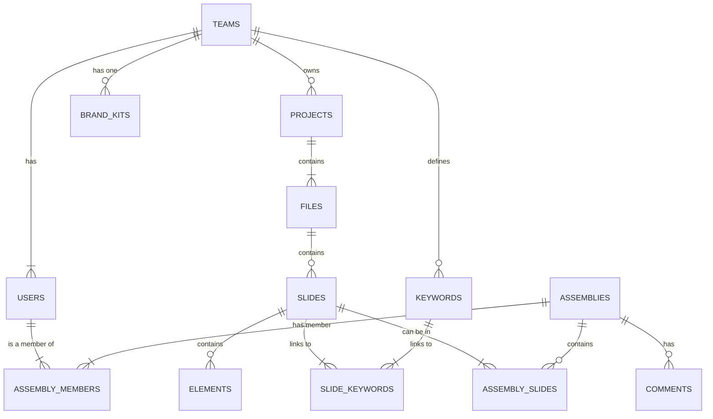

Of course. The communication contract is now set in stone. We must now define the new "memory palace" for PrezI—the multi-tenant database that will securely and efficiently store the collective knowledge of all users and teams.

This is a critical architectural step. Moving from a single-user SQLite file to a robust, managed cloud database requires a fundamental rethinking of the data structure to ensure strict data isolation and high performance.

Here is **Document 6 of 10**, the definitive Database Schema for the PrezI SaaS platform.

---
---

### **Document 6 of 10: Detailed Database Schema - SaaS Edition**

# PrezI Cloud: Detailed Database Schema

*   **Version:** 2.0 (SaaS)
*   **Date:** June 7, 2025
*   **Status:** Finalized

## 1. Database System Rationale

*   **System:** **PostgreSQL 15+** on **AWS RDS (Relational Database Service)**
*   **Rationale:**
    1.  **Production-Ready & Scalable:** AWS RDS provides managed, enterprise-grade features essential for a SaaS product, including automated backups, point-in-time recovery, read replicas for scalability, and automated maintenance.
    2.  **Robust Data Integrity:** PostgreSQL is renowned for its strong adherence to SQL standards and its powerful features for ensuring data integrity, which is paramount when handling data for multiple customers.
    3.  **Advanced Indexing:** It offers powerful indexing capabilities, including GIN indexes for full-text search, which will be critical for performance.
    4.  **Multi-Tenancy Support:** Its row-level security features provide a robust mechanism for enforcing strict data isolation between different teams.

## 2. Core Architectural Principle: Multi-Tenancy

The entire schema is built around the concept of **multi-tenancy**. Every table that contains user or team-specific data will have a mandatory `team_id` column.

*   **Data Isolation:** All backend queries **MUST** include a `WHERE team_id = :current_user_team_id` clause. This is a non-negotiable security requirement to ensure no team can ever access another team's data. This will be enforced at the application layer and can be further hardened with PostgreSQL's Row-Level Security policies.

## 3. Entity-Relationship Diagram (ERD) - SaaS Edition

This diagram illustrates the evolved relationships for a multi-tenant, collaborative environment.



## 4. Table Definitions (SQL DDL)

### 4.1. Core Tenancy & User Tables
```sql
-- Stores information for each customer team/organization
CREATE TABLE teams (
    team_id         UUID PRIMARY KEY DEFAULT gen_random_uuid(),
    team_name       TEXT NOT NULL,
    subscription_tier TEXT NOT NULL DEFAULT 'free', -- e.g., 'free', 'pro', 'business'
    created_at      TIMESTAMPTZ DEFAULT now()
);

-- Stores user accounts, linked to a team
CREATE TABLE users (
    user_id         UUID PRIMARY KEY DEFAULT gen_random_uuid(),
    team_id         UUID NOT NULL REFERENCES teams(team_id) ON DELETE CASCADE,
    email           TEXT NOT NULL UNIQUE,
    password_hash   TEXT NOT NULL,
    role            TEXT NOT NULL DEFAULT 'creator', -- e.g., 'admin', 'creator', 'viewer'
    created_at      TIMESTAMPTZ DEFAULT now()
);
```

### 4.2. Content & Organization Tables (Now with `team_id`)
```sql
-- Projects are now owned by a team
CREATE TABLE projects (
    project_id      UUID PRIMARY KEY DEFAULT gen_random_uuid(),
    team_id         UUID NOT NULL REFERENCES teams(team_id) ON DELETE CASCADE,
    name            TEXT NOT NULL,
    created_at      TIMESTAMPTZ DEFAULT now()
);

-- Files are globally unique but linked to a project context
CREATE TABLE files (
    file_id         UUID PRIMARY KEY DEFAULT gen_random_uuid(),
    project_id      UUID NOT NULL REFERENCES projects(project_id) ON DELETE CASCADE,
    s3_path         TEXT NOT NULL UNIQUE, -- Path to the file in the S3 bucket
    original_filename TEXT NOT NULL,
    processing_status TEXT NOT NULL DEFAULT 'pending', -- 'pending', 'processing', 'completed', 'failed'
    slide_count     INTEGER,
    uploaded_by     UUID NOT NULL REFERENCES users(user_id),
    created_at      TIMESTAMPTZ DEFAULT now()
);

-- Slides now reference files directly
CREATE TABLE slides (
    slide_id        UUID PRIMARY KEY DEFAULT gen_random_uuid(),
    file_id         UUID NOT NULL REFERENCES files(file_id) ON DELETE CASCADE,
    slide_number    INTEGER NOT NULL,
    thumbnail_s3_path TEXT NOT NULL,
    extracted_text  TEXT,
    -- All other fields like ai_topic, etc. remain
    UNIQUE(file_id, slide_number)
);

-- Keywords are now scoped to a team
CREATE TABLE keywords (
    keyword_id      UUID PRIMARY KEY DEFAULT gen_random_uuid(),
    team_id         UUID NOT NULL REFERENCES teams(team_id) ON DELETE CASCADE,
    text            TEXT NOT NULL,
    color_hex       TEXT,
    UNIQUE(team_id, text)
);

-- Linking tables (slide_keywords, element_keywords) remain structurally similar but use UUIDs.
```

### 4.3. Collaboration & Assembly Tables
```sql
CREATE TABLE assemblies (
    assembly_id     UUID PRIMARY KEY DEFAULT gen_random_uuid(),
    team_id         UUID NOT NULL REFERENCES teams(team_id) ON DELETE CASCADE,
    name            TEXT NOT NULL,
    created_by      UUID NOT NULL REFERENCES users(user_id),
    created_at      TIMESTAMPTZ DEFAULT now()
);

-- Maps users to assemblies they have access to
CREATE TABLE assembly_members (
    assembly_id     UUID NOT NULL REFERENCES assemblies(assembly_id) ON DELETE CASCADE,
    user_id         UUID NOT NULL REFERENCES users(user_id) ON DELETE CASCADE,
    permission      TEXT NOT NULL DEFAULT 'edit', -- 'edit', 'view'
    PRIMARY KEY (assembly_id, user_id)
);

CREATE TABLE assembly_slides (
    -- Links slides to an assembly, preserving order
    id              UUID PRIMARY KEY DEFAULT gen_random_uuid(),
    assembly_id     UUID NOT NULL REFERENCES assemblies(assembly_id) ON DELETE CASCADE,
    slide_id        UUID NOT NULL REFERENCES slides(slide_id) ON DELETE CASCADE,
    slide_order     INTEGER NOT NULL
);

CREATE TABLE comments (
    comment_id      UUID PRIMARY KEY DEFAULT gen_random_uuid(),
    assembly_id     UUID NOT NULL REFERENCES assemblies(assembly_id) ON DELETE CASCADE,
    slide_id        UUID REFERENCES slides(slide_id), -- Can be null for general assembly comments
    user_id         UUID NOT NULL REFERENCES users(user_id),
    content         TEXT NOT NULL,
    created_at      TIMESTAMPTZ DEFAULT now()
);
```

### 4.4. Brand Kit Table
```sql
CREATE TABLE brand_kits (
    brand_kit_id    UUID PRIMARY KEY DEFAULT gen_random_uuid(),
    team_id         UUID NOT NULL UNIQUE REFERENCES teams(team_id) ON DELETE CASCADE,
    primary_color   TEXT,
    secondary_color TEXT,
    logo_s3_path    TEXT,
    default_font    TEXT
);
```

## 5. Indexing Strategy for Performance

In addition to primary and foreign key indexes, the following are critical for SaaS performance:
*   **Multi-tenancy Index:** Every table with a `team_id` will have an index on that column. `CREATE INDEX ON projects(team_id);`
*   **Full-Text Search Index:** A GIN (Generalized Inverted Index) will be created on the `extracted_text` column of the `slides` table for high-performance text search. `CREATE INDEX slides_text_gin_idx ON slides USING GIN (to_tsvector('english', extracted_text));`
*   **Foreign Key Indexes:** Indexes on all foreign key columns (e.g., `slides(file_id)`) are essential for fast joins.

This multi-tenant database schema provides a secure, scalable, and robust foundation for the PrezI SaaS platform, ensuring that team data is both strictly isolated and instantly accessible.