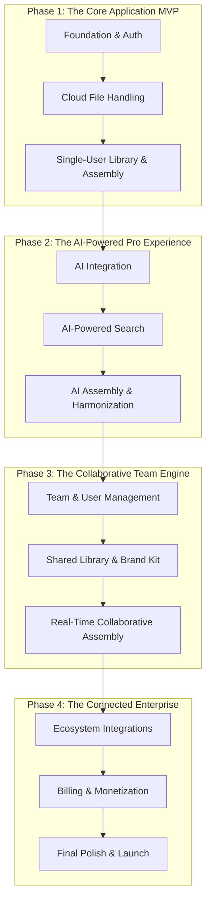

Of course. The business logic is now set in stone.

We are nearing the completion of our blueprint. With the product, architecture, design, AI, API, database, and business model all defined, we must now create the final two operational documents that ensure a smooth construction and a resilient, professional final product.

The next document is the master "Plan of Attack" for the AI coding agent. It translates our entire grand vision into a sequential, step-by-step construction plan. It is the tactical guide that will turn all our strategic documents into working code.

Here is **Document 8 of 10**, the definitive Development & Testing Plan for the PrezI SaaS platform.

---
---

### **Document 8 of 10: Development & Testing Plan - SaaS Edition**

# PrezI Cloud: Development & Testing Plan

*   **Version:** 2.0 (SaaS)
*   **Date:** June 7, 2025
*   **Status:** Finalized

## 1. Development Philosophy

This plan is built on the principles of **Incremental Value Delivery** and **Continuous Integration**. We will build the platform in logical phases, starting with a core, single-user experience and progressively layering on collaborative and team-based features. Every feature built will be accompanied by a suite of automated tests to ensure quality and prevent regressions. The **Agent Handover Protocol** remains in full effect to ensure development continuity.

## 2. Phased Rollout Strategy

The development is structured into four major phases, designed to deliver value at each stage.

## 3. Detailed Sprint Breakdown

### **Phase 1: The Core Application MVP**
*Goal: Create a functional, single-user version of PrezI running on our cloud architecture. This will be the foundation for the "Professional" tier.*

#### **Sprint 1: Cloud Foundation & Authentication**
| Task ID | Task Description |
| :--- | :--- |
| ☐ **1.1**| Set up the cloud infrastructure using Terraform/IaC (VPC, S3 buckets, RDS instance, ECS cluster definition). |
| ☐ **1.2**| Implement the `Authentication Service` with AWS Cognito, including the `/auth/register` and `/auth/login` endpoints. |
| ☐ **1.3**| Build the React frontend for the Login and Sign-up pages. |
| ☐ **1.4**| Implement JWT token handling on the frontend for authenticating all subsequent API calls. |

#### **Sprint 2: Cloud File Processing Pipeline**
| Task ID | Task Description |
| :--- | :--- |
| ☐ **2.1**| Implement the `POST /projects/{project_id}/files/upload-url` endpoint to generate a pre-signed S3 URL. |
| ☐ **2.2**| Implement the asynchronous processing pipeline using SQS and the Fargate-based `Slide Processing Service`. |
| ☐ **2.3**| The processing service must successfully download the `.pptx` from S3, extract slide thumbnails and text, and populate the PostgreSQL database. **Note:** This requires a headless solution for PowerPoint conversion on a Linux container (e.g., using LibreOffice). |
| ☐ **2.4**| Implement the `TASK_PROGRESS` WebSocket events to provide real-time feedback to the UI during file processing. |

#### **Sprint 3: Single-User Workspace**
| Task ID | Task Description |
| :--- | :--- |
| ☐ **3.1**| Implement the `Slides Service` API endpoints for managing projects, slides, and keywords for a single user. |
| ☐ **3.2**| Build the main three-panel application UI in React, including the interactive Slide Library, Keyword Panel, and Assembly Panel. |
| ☐ **3.3**| Connect the UI to the backend API to display and filter slides and keywords. |
| ☐ **3.4**| Implement manual assembly (click-to-add, drag-to-reorder) and the `.pptx`/`.pdf` export functionality. |

---

*(Sprints for Phases 2, 3, and 4 will be detailed with the same level of granularity once Phase 1 is complete.)*

## 4. Testing Strategy: The Automated Quality Mandate

To ensure a reliable SaaS platform, a comprehensive automated testing strategy is non-negotiable.

1.  **Backend Unit Tests (`pytest`):**
    *   Every service function and helper utility will have unit tests to verify its logic in isolation.
    *   **Goal:** 80%+ code coverage for the Python backend.

2.  **Frontend Unit Tests (`Jest` + `React Testing Library`):**
    *   Every React component will have unit tests to verify it renders correctly given different props.
    *   **Goal:** Test critical UI logic and component states.

3.  **API Integration Tests (`pytest`):**
    *   A dedicated test suite will run against a live test environment. It will call every single API endpoint defined in the **API Specification** and assert that the responses are correct. This is the "contract test" that ensures the frontend and backend can always communicate.

4.  **End-to-End (E2E) Tests (`Cypress` or `Playwright`):**
    *   These are the most critical tests. Automated scripts will launch a browser, log in as a test user, and perform complete user workflows from start to finish.
    *   **Example E2E Test: `test_team_collaboration.js`**
        1.  Admin user logs in.
        2.  Invites a new team member.
        3.  New team member receives the (mocked) email, signs up, and logs in.
        4.  Admin creates an assembly and shares it with the new member.
        5.  New member opens the assembly and adds a slide.
        6.  The test asserts that the Admin's UI updates in real-time via WebSockets to show the newly added slide.

## 5. Definition of "Done" (DoD)

A feature is only "Done" when it meets all criteria from our original DoD, with the addition of:
*   **Infrastructure Defined:** All necessary cloud infrastructure is defined in the IaC (Terraform) scripts.
*   **Multi-Tenancy Enforced:** All database queries for the feature are confirmed to be scoped by `team_id`.
*   **Tier Gating Implemented:** Access to the feature is correctly restricted based on the user's subscription tier.

This SaaS-focused development plan provides a clear, phased, and quality-driven roadmap for building the PrezI Cloud platform.